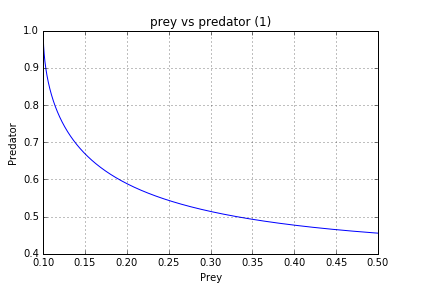
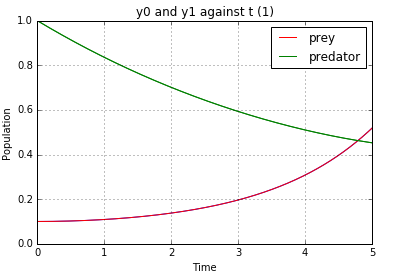
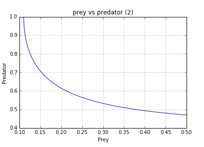
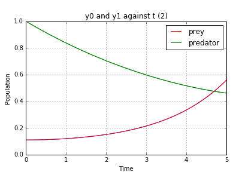

UECM3033 Assignment #3 Report
========================================================

- Prepared by: chong Kar Yee
- Tutorial Group: T3

--------------------------------------------------------

## Task 1 --  Gauss-Legendre formula

The reports, codes and supporting documents are to be uploaded to Github at: 
https://github.com/chongkaryee/UECM3033_assign3.git

Explain how you implement your `task1.py` here.
In task 1, we have to import numpy and spicy first before we approximate an integrate function with N-point Gauss-Legendre quadrature, the defined function named gausslegendre(f, a, b, n=20) is to fix the number of nodes, weights and positions of nodes to be accurate. We use np.polynomial.legendre.leggauss(n) to computes the weights (w) and nodes (x) for Gauss-Legendre quadrature by using numbers of nodes (n) =20. These weights and nodes will correctly integrate polynomials of degrees two or less over interval [-1,1] with weight function of f(x)=1.  After that, we extend the x values in interval [-1,1] for Gaussian quadrature to a more general interval [a,b] by using equation of t = 0.5*(x + 1)*(b - a) + a. The ans which we initialized to zero at the very beginning can be calculated by summing up the new x values in interval [a,b] multiplied by the weights and then multiply the half of differneces between a and b. Lastly, we can print out the ans for my_integral() function and gausslegendre(f, 0,1)) function. 
Explain how you get the weights and nodes used in the Gauss-Legendre quadrature.
The weights and nodes can be obtained by using np.polynomial.legendre.leggauss.

---------------------------------------------------------

## Task 2 -- Predator-prey model

Explain how you implement your `task2.py` here, especially how to use `odeint`.
In task 2, firstly, I import numpy, scipy and matpltlib.pyplot from library. Secondly, I defined a function called p(y,t). I created a array of prey and predator as pp and prey and predator was calculated then I return pp to p(y,t). Then, I used numpy to create an array of y0 and y1 and initializes initial condition of  y0=0.1 and y1=1.0. Before integration, time (t) from t=0 to t=5 is formed by using linspace so that evenly spaced t over 0<t<5 can be returned. With these data, we can solve a system of ordinary differential equations using lsoda from the FORTRAN library odepack by using sp.integrate.odeint. Ans which integrated stored in array form. Next, we plot two graphs which are graph of y0 and y1 against t and graph of y1 against y0. In order to test the sensitivity on initial conditions, steps for solve the system of ODEs with scipy.integrate.odeint and plotted graph of y0 and y1 against t and graph of y1 against y0 was repeated but with different initial condition of y0=0.11 and y1=1.0. 

Put your graphs here and explain.
Initial condition of y0=0.1, y1=1.0

Initial condition of y0=0.11, y1=1.0

From the graphs above, we can conclude that there is inverse relationship between prey and predator. As naturally, when the number of predators increases, number of prey deceases. Over a period, we can see that the number of prey increased, number of predator can be decreased and number of prey can be larger than the number of predator in which inverse relationship shown. However, there is only a little and unsignificant changes in results for the changes in initial condition. 

Is the system of ODE sensitive to initial condition? Explain.
No. There is only slight changes in system of ODE for the little change in initial condition. Usually, if the system of ODE is sensitive to initial condition, a small changes in initial condition will cause a large significant changes in system of ODE. 

-----------------------------------

last modified: 16.4.2016
